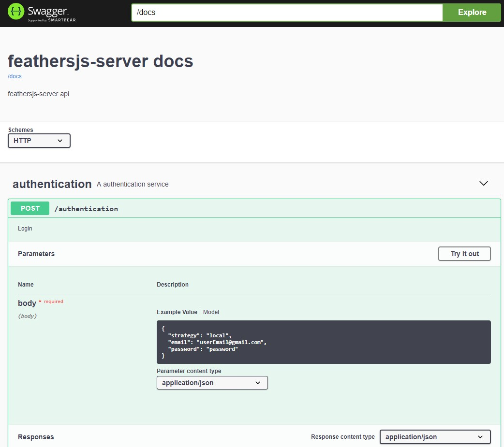
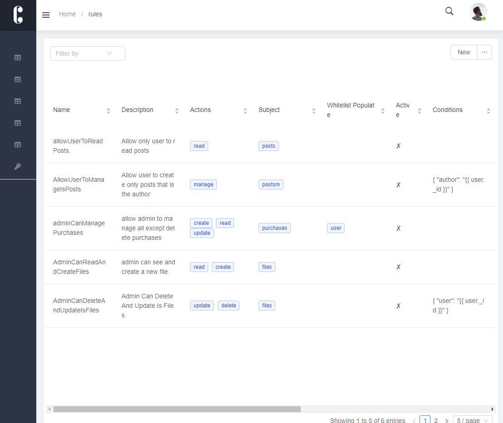

# Ecosystem

### Authentication

* [**@feathersjs/authentication**](https://github.com/feathersjs/authentication) **** Feathers local, token, _and_ OAuth authentication over REST and Websockets using JSON Web Tokens \(JWT\) with PassportJS.
* [feathersjs-authentication-management](https://github.com/feathers-plus/feathers-authentication-management) **** Adds sign up verification, forgotten password reset, and other capabilities to local [`feathersjs/authentication`](https://docs.feathersjs.com/api/authentication/local-management.html).
* **emails**
  * [pug](https://pugjs.org/api/getting-started.html) Pug – robust, elegant, feature rich template engine for Node.js
  * [feathers-mailer](https://github.com/feathersjs-ecosystem/feathers-mailer) Feathers mailer service using nodemailer

### Authorization

* [**casl**](https://github.com/stalniy/casl)  CASL is an isomorphic authorization JavaScript library which restricts what resources a given user is allowed to access

### **Validation**

* [joi](https://github.com/hapijs/joi)  Object schema validation

### **Docs**

* [Swaager](https://swagger.io/) documentation UI for you api

### **Dashboard**

* [Redux-admin](https://www.npmjs.com/package/redux-admin) A dashboard for managing your DB.

Screenshot from dashboard  screen:

### Files

* [feathers-blob ](https://github.com/feathersjs-ecosystem/feathers-blob)- Feathers service for blob storage, like S3

