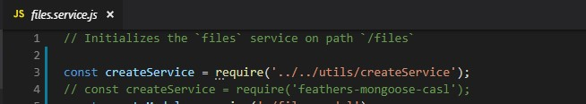

# customized feathers-mongoose-casl/services

If you need to customized feathers-mongoose-casl/services you can copt the files from node\_modules to your folder

### 1 - open node\_modules\feathers-mongoose-casl\lib

### 2- copy the service folder to your src/services

### 3- fix on top of the files the dependence

pass over the files and find where you need to change the import path,  
you can see it is ready to you with comments in the files  
you can just search for " require\('feathers-mongoose-casl'\)" and find all the place to change  
  
for example

Before



after


### 4- Open src\services\index.js and require the service from is new location 

```javascript
const users= require('./users/users.service.js');
const authManagement= require('./authmanagement/authmanagement.service.js');
const notifier= require('./authmanagement\notifier\index.js');
const mailer= require('./mailer/mailer.service.js');
const rules= require('./rules/rules.service.js');
const uploads= require('./uploads/uploads.service.js');
const files= require('./files/files.service.js');
const sms= require('./sms/sms.service.js');
const dashboard= require('./dashboard/dashboard.service.js');
const userAbilities= require('./userAbilities/userAbilities.service.js');

// eslint-disable-next-line no-unused-vars
module.exports = function (app) {
  // copy from feathers-mongoose-casl services
  app.configure(users);
  app.configure(authManagement);
  app.configure(notifier);
  app.configure(mailer);
  app.configure(rules);
  app.configure(uploads);
  app.configure(files);
  // app.configure(sms) // we disabled this for now
  app.configure(dashboard);
  app.configure(userAbilities);
};

```

