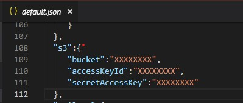

# S3

### 1 - Create s3 bucket <a id="2-create-s3-bucket"></a>

Follow this useful guide [https://github.com/keithweaver/python-aws-s3​](https://github.com/keithweaver/python-aws-s3)


### 2- Update config file <a id="3-update-config-file"></a>

/config/default.json



## How to upload file with [feathers client](https://docs.feathersjs.com/api/authentication/client.html)

Copy this yo your client app-

```javascript
const axios = require("axios");
const app = feathers();
const restClient = rest("http://localhost:3030");
app.configure(restClient.axios(axios));

// Available options are listed in the "Options" section
app.configure(
  auth({
    header: "Authorization", // the default authorization header for REST
    prefix: "", // if set will add a prefix to the header value. for example if prefix was 'JWT' then the header would be 'Authorization: JWT eyJ0eXAiOiJKV1QiLCJhbGciOi...'
    path: "/authentication", // the server-side authentication service path
    jwtStrategy: "jwt", // the name of the JWT authentication strategy
    entity: "user", // the entity you are authenticating (ie. a users)
    service: "users", // the service to look up the entity
    cookie: "feathers-jwt", // the name of the cookie to parse the JWT from when cookies are enabled server side
    storageKey: "feathers-jwt", // the key to store the accessToken in localstorage or AsyncStorage on React Native
    storage: cookieStorage // Passing a WebStorage-compatible object to enable automatic storage on the client.
  })
);

  //Upload to S3
  const upload = (acceptedFiles, rejectedFiles) => {
    var formData = new FormData();
    formData.append("file", acceptedFiles[0], "chris.jpg");
    app
      .service("uploads")
      .create(formData, {
        headers: {
          "content-type": "multipart/form-data"
        }
      })
      .then(res => {
        alert("upload ends");
      })
      .catch(err => {
        alert(err.message);
      });
  };

  //Upload to local
  const upload = (acceptedFiles, rejectedFiles) => {
    var formData = new FormData();
    formData.append("file", acceptedFiles[0], "chris.jpg");
    app
      .service("uploads-static")
      .create(formData, {
        headers: {
          "content-type": "multipart/form-data"
        }
      })
      .then(res => {
        alert("upload ends");
      })
      .catch(err => {
        alert(err.message);
      });
  };
```

```text

```

