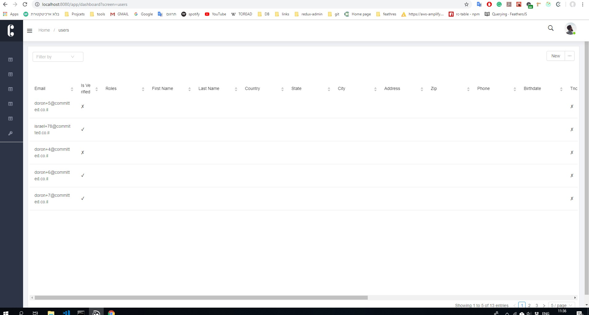

# Dashboard

### [feathersjs-mongoose-casl-admin](https://feathersjs-mongoose-casl-admin.herokuapp.com/) is a dashboard to your local server, with this dashboard you can see any collection in your app and create/edit/delete documents.


#### network error ?     Keep you local server run, the app look for   localhost:3030


## Want to test it with other server url?

add serverUrl to url query:

[https://feathersjs-mongoose-casl-admin.herokuapp.com?serverUrl=https://someurl.com](install-feathers-mongoose-casl.md)


## You can't see data in the dashboard, to fix it we will add this rule-

1- Open config/default.json  
2- Add inside feathers-mongoose-casl.defaultRules this:

```text
    "defaultRules": [    ....      {        "userContext": {"email": "<YOUR_EMAIL>@gmail.com"},        "actions": ["manage"],        "subject": ["dashboard","users","user-abilities","rules","files","posts"]      },
```

## Now refresh dashboard screen


This work with your local server then keep your server running




