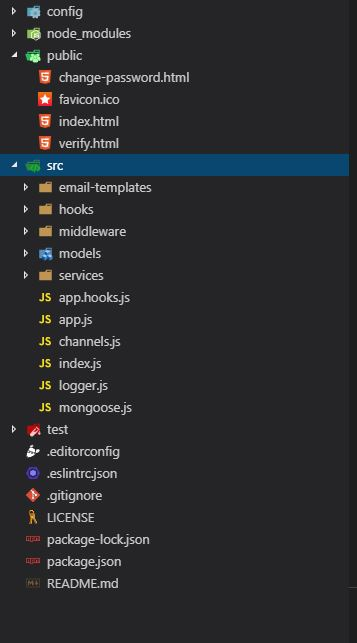

# public HTML

\*\*We need 2 screens to let the user the ability to verify is email and to reset-password

* **verify.html**

  When user signup we will send him a verification email with a link to this screen, the link has a token that let as verify user email

* **change-password.html** When the user forgot his password we will send him an email with a link to this screen, the link has a token that let as verify the user. and the user can change is password from this screen

.  
**1- open** node\_modules\feathers-mongoose-casl\lib\src\services\authmanagement\public

2- **Copy the files to** my-new-app\public



3- **Git commit**

```text
git add .
git commit -m "create verify and change-password public html"
```


By default we use change-password.html route to change password,

If you want to change password from other address, add this line to config file-

"changePasswordClientUrl": "[http://localhost:8080/change-password](http://localhost:8080/change-password)"


