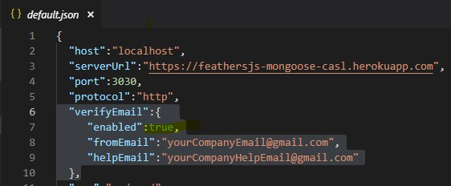
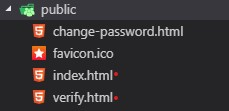

# Authentication

### We use 2 libraries to handle user authentication  ****[**@feathersjs/authentication**](https://github.com/feathersjs/authentication) **** Feathers local, token, _and_ OAuth authentication over REST and Websockets using JSON Web Tokens \(JWT\) with PassportJS.

  
****[**feathers-authentication-management**](https://github.com/feathers-plus/feathers-authentication-management)  
****Adds sign up verification, forgotten password reset, and other capabilities to local feathers-authentication

#### How to Create a new user?

```perl
curl -X POST \
  http://localhost:3030/users \
  -H 'Content-Type: application/json' \
  -H 'Postman-Token: 5ad6571f-e2dd-4737-b0e5-73d2fe8986fe' \
  -H 'cache-control: no-cache' \
  -d '{
	"email": "yourEmail@gmail.com",
	"password": "password"
}'
```

### How to Login?

```perl
curl -X POST \
  http://localhost:3030/authentication \
  -H 'Content-Type: application/x-www-form-urlencoded' \
  -H 'Postman-Token: 5b8c84e3-303f-4eb2-9a24-06418fb7e8a8' \
  -H 'cache-control: no-cache' \
  -d 'email=doron.nahum%2B10%40gmail.com&password=password&strategy=local'
```

### How To disable the verify email service?

set false at verifyEmail.enable in the config file



### How to customize the verify and the reset view?

replace this html files in your public folder




## [**authentication-management**](https://github.com/feathers-plus/feathers-authentication-management) **end points**

## **Please read this document** [**https://github.com/feathers-plus/feathers-authentication-management/blob/master/docs.md**](https://github.com/feathers-plus/feathers-authentication-management/blob/master/docs.md)\*\*\*\*

```text
fetch('/authManagement', {
  method: 'POST',
  headers: { Accept: 'application/json' },
  body: JSON.stringify(
    { action: <ACTION NAME>,
    value: <VALUE> 
  })
})
```

### 1. Resend Verify Signup

```text
{ 'action':'resendVerifySignup',
'value':{ 'email':'userEaail@gmail.com' } }
```

### 2. Check Unique

```text
{ 
  'action':'checkUnique', 
  'value':{
    'email':'userEaail@gmail.com'
  }
}
```

### 3. Verify Signup Long

```text
{ 
  'action':'verifySignupLong', 
  'value':'281813b93785a68e7590833bed58e5' 
}
```

### 4. Password Change

```text
{
 'action':'passwordChange', 
 'value':{ 
 'user':{ 'email':'userEmail@gmail.com' }, 
 'oldPassword':'password', 'password':'1234578' 
 }}
```

### 5. Send Reset Pwd

```text
{
 'action':'sendResetPwd',
 'value':{ 
   'email':'userEmail@gmail.com' 
  }
}
```

